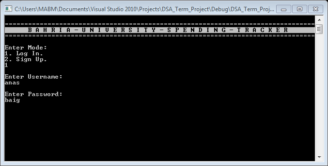
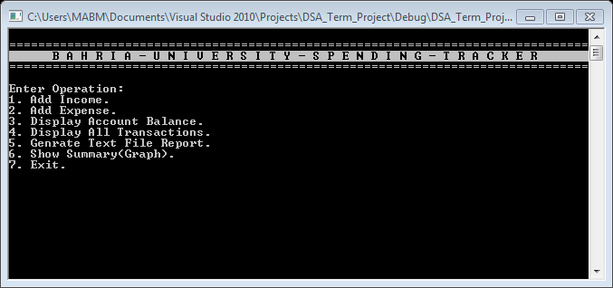
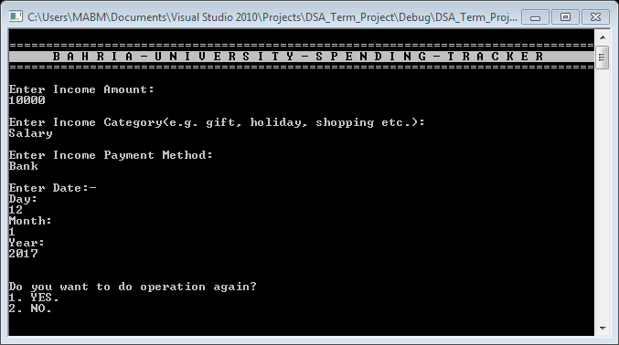
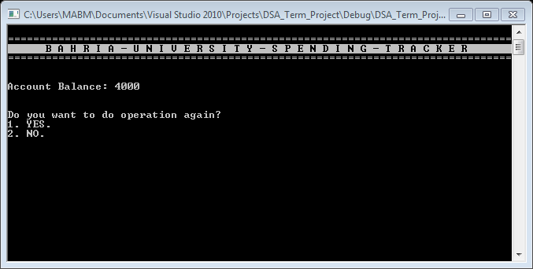
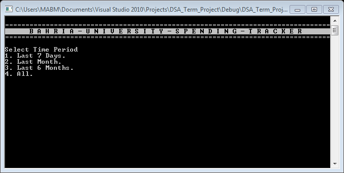
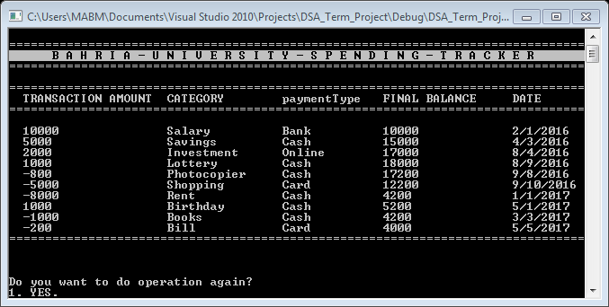
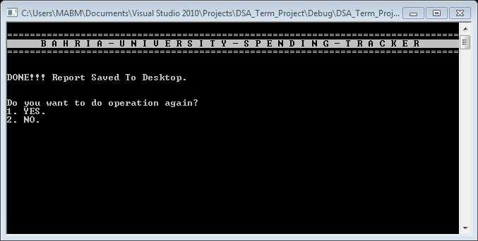
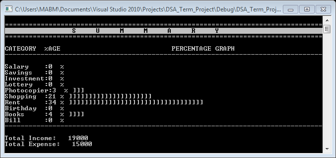
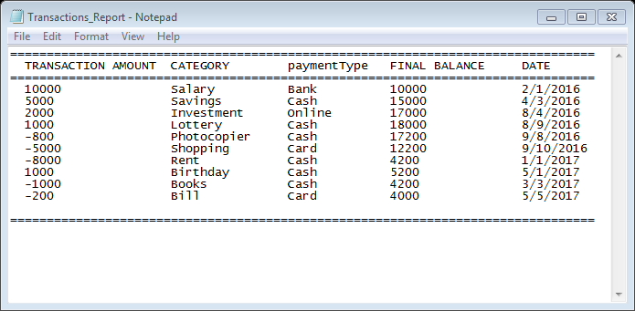

# dsa-semester-project
Data Structures and Algorithms Semester Project

### Introduction:
Spending Tracker is basically an application which keeps record of the daily Income and Expenses of the user. It helps the user to maintains his daily budget and saves money by keeping an eye on his spending.

### Programming Concepts Used:
1.	Linked Lists.
2.	Dynamic Memory Allocation.
3.	Traversing Linked Lists.
4.	Composition
5.	Insertion.
6.	Searching.
7.	Pointers.
8.	Functions.
9.	Strings.

### Application Features:
* Secure Sign Up and Log In; completely secure Sign up with storing user credentials in Binary File Format which is unreadable by human. No duplication in Usernames.
* Text File Report Generation which user can use for any purpose like printing or storing as backup.
* Summary Graphs and Percentage Analysis to each expense category which makes it easy for user to determine its expenses. 
* Separate file to store transactions for each user which can’t be accessed without password.
* Add Incomes/Expenses with information such as Amount, Date, Payment Method used and Category.
* Displays Final Balance in Account after each transaction is made.
* Displays Transactions List according to user’s choice as last 7 Days, last Month or Yearly.
* Best and most important feature is that it can be used on a Public PC where each user has its own USERNAME and PASSWORD and has its own separate file which can’t be accessed without password. 

